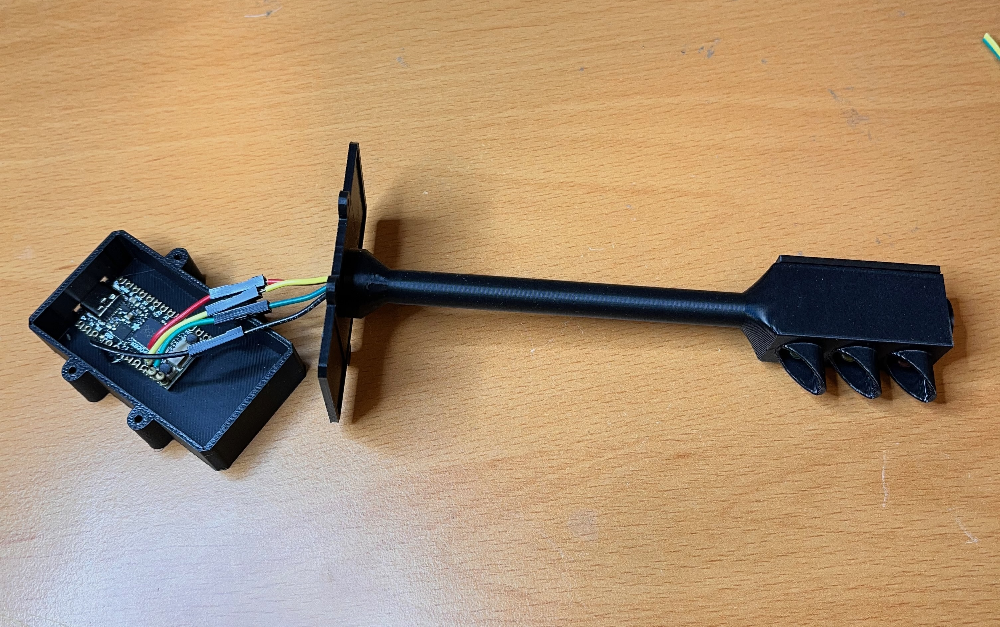
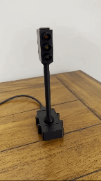

# Simple Traffic Light Simulation

## Overview
This project simulates a traffic signal using **CircuitPython** on the **Adafruit KB2040** board. The traffic signal consists of three T1 LEDs (red, yellow, and green) controlled through the board, with 100 ohm resistors to limit current. The LEDs are mounted inside a 3D-printed traffic signal, which can be placed on a desk.

### Features:
- Uses random timing for green, yellow, and red lights to simulate realistic traffic signal behavior.
- Provides a simple startup sequence to test the LED wiring.
- Built to fit into a 3D-printed traffic light model for display.

## Components Used:
- [CircuitPython](https://circuitpython.org) (running on the KB2040)
- [Adafruit KB2040](https://www.adafruit.com/product/5302)
- Three T1 LEDs (red, yellow, green)
- Three 100-ohm resistors
- [3D-Printed Traffic Light Model](https://www.thingiverse.com/thing:3469713) by *Nodemcu ESP8266 Traffic Light*

## Assembly Instructions:
1. **Wiring**:
   - Connect the red, yellow, and green LEDs to pins D7, D8, and D9 respectively.
   - Add a 100-ohm resistor to each LED to limit the current.
   - Reference the wiring construction below for a simple setup.

2. **3D Print**:
   - Print the traffic light case from the [Thingiverse model](https://www.thingiverse.com/thing:3469713) and insert the LEDs into their respective slots.
   
3. **Load Code**:
   - Download or clone this repository:
     ```bash
     git clone https://github.com/yourusername/traffic-light-simulation.git
     ```
   - Copy the `code.py` to the root of your CircuitPython KB2040 board.

## Media
### Wiring Construction


### Demo


## License
This project is licensed under the MIT License. See the [LICENSE](LICENSE) file for more details.

## 3D Print Attribution
The 3D-printed traffic light model used in this project is based on the [Nodemcu ESP8266 Traffic Light](https://www.thingiverse.com/thing:3469713) by *Alex_Thunder*. 

This model is licensed under the [Creative Commons Attribution 4.0 International License](https://creativecommons.org/licenses/by/4.0/). You are free to share and adapt the model as long as you give appropriate credit to the original creator.
